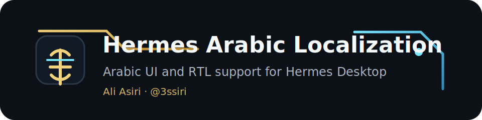
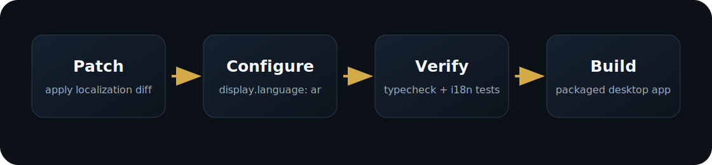

<p align="center">
  
</p>

<p align="center">
  
</p>

<p align="center">
  <a href="README.ar.md">العربية</a>
  ·
  <a href="https://github.com/3ssiri/hermes-arabic-localization/issues">Issues</a>
  ·
  <a href="https://github.com/NousResearch/hermes-agent">Hermes Agent</a>
</p>

# Hermes Arabic Localization

Arabic interface support for **Hermes Desktop**, distributed as a patch and installer scripts.

The repository keeps the original Hermes project separate. It applies a focused desktop localization patch to an existing Hermes checkout, sets Arabic as the desktop language, and verifies the result with the desktop test commands.

Original project: https://github.com/NousResearch/hermes-agent

Upstream PR: https://github.com/NousResearch/hermes-agent/pull/45619

Maintainer: **Ali Asiri** · X: https://x.com/3li3

## Why This Repository Exists

The localization has been submitted upstream for review. This repository gives Arabic-speaking users a practical way to install and test the work while the official review continues. It also keeps the change auditable: the package is a patch, not a redistributed Hermes build.

## Install

Windows PowerShell:

```powershell
git clone https://github.com/3ssiri/hermes-arabic-localization.git
cd hermes-arabic-localization
.\scripts\apply-arabic.ps1 -Build
```

Default Hermes path:

```text
%LOCALAPPDATA%\hermes\hermes-agent
```

Custom path:

```powershell
.\scripts\apply-arabic.ps1 -HermesPath "C:\path\to\hermes-agent" -Build
```

Run the built app:

```text
%LOCALAPPDATA%\hermes\hermes-agent\apps\desktop\release\win-unpacked\Hermes.exe
```

## Included

- Arabic (`ar`) desktop locale.
- RTL direction for the Electron renderer.
- Arabic settings, providers, accounts, API keys, MCP, archived chats, about, and uninstall copy.
- Credential-row localization for Tools & Keys.
- Locale registration and language aliases.
- Desktop i18n tests.

## Not Included

- Agent behavior changes.
- Prompt changes.
- Model-tool changes.
- Backend API changes.
- Provider logic changes.
- Dashboard localization.

## How It Works

<p align="center">
  
</p>

The main script:

```text
scripts/apply-arabic.ps1
```

It applies:

```text
patches/desktop-arabic-localization.patch
```

Then it sets:

```yaml
display:
  language: ar
```

## Verify

```powershell
cd $env:LOCALAPPDATA\hermes\hermes-agent\apps\desktop
npm run typecheck
npm run test:ui -- src/i18n/runtime.test.ts src/i18n/languages.test.ts src/i18n/context.test.tsx src/components/language-switcher.test.tsx
```

## Files

| Path | Purpose |
| --- | --- |
| `patches/desktop-arabic-localization.patch` | Desktop Arabic localization patch |
| `scripts/apply-arabic.ps1` | Windows installer |
| `scripts/apply-arabic.sh` | macOS/Linux installer |
| `scripts/verify.ps1` | Verification helper |
| `docs/` | Installation, update, and troubleshooting notes |
| `.github/workflows/` | Scheduled upstream and issue monitoring |

## Credits

Arabic desktop localization maintained by:

- Ali Asiri
- Email: assiri@gmail.com
- X: https://x.com/3li3

Hermes Agent remains owned and licensed by its original authors and contributors.
